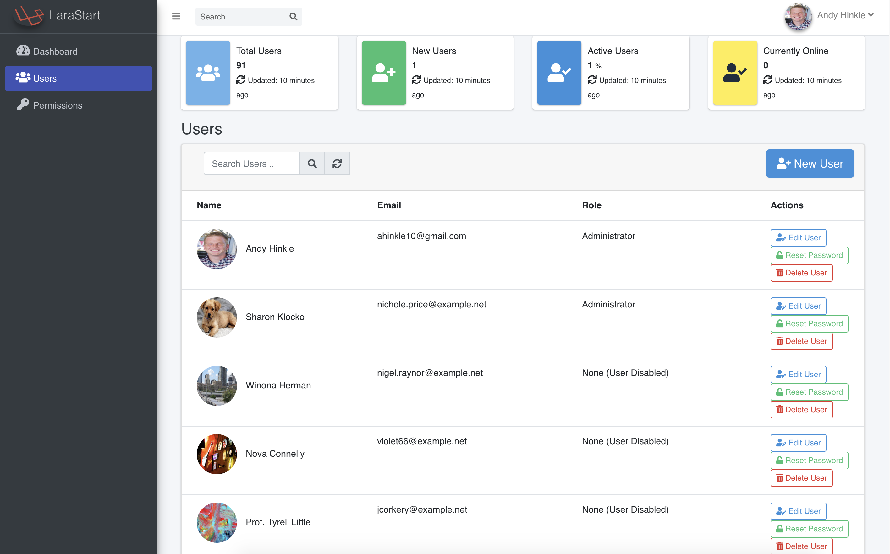

# LaraStart
Starter Admin template for Laravel, Vue.js, and Bootstrap 4. Inspired by Laravel Nova. Includes User Management, Roles, and Profile components to quickly get you up and running with your new Laravel app.

# Installation
First, install all of your composer packages:
``` 
 $ composer install
```
> Configure your local database settings in .env

Migrate you database and create your schema:

```
 $ php artisan migrate
```

Finally, since we are using Vue, we must compile all of our assets:
````
 $ npm run dev
````

## Screenshot:

    
 ## Uses:
  * Laravel Framework
  * Spatie Laravel Permissions
  * Bootstrap 4
  * Font Awesome 5.2
  * Vue.js
  * Vue Router
  
 ## Future:
  * Expand Dashboard
  * Unit Tests
